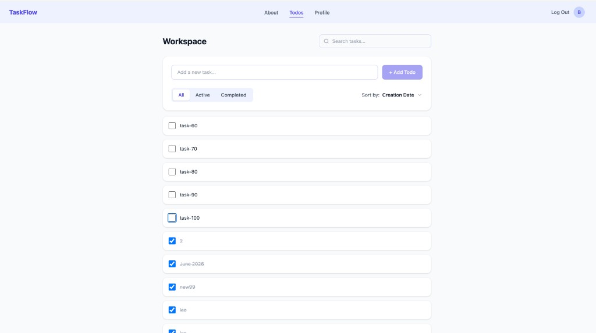
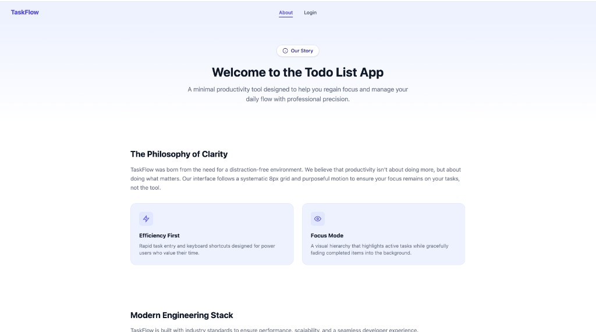
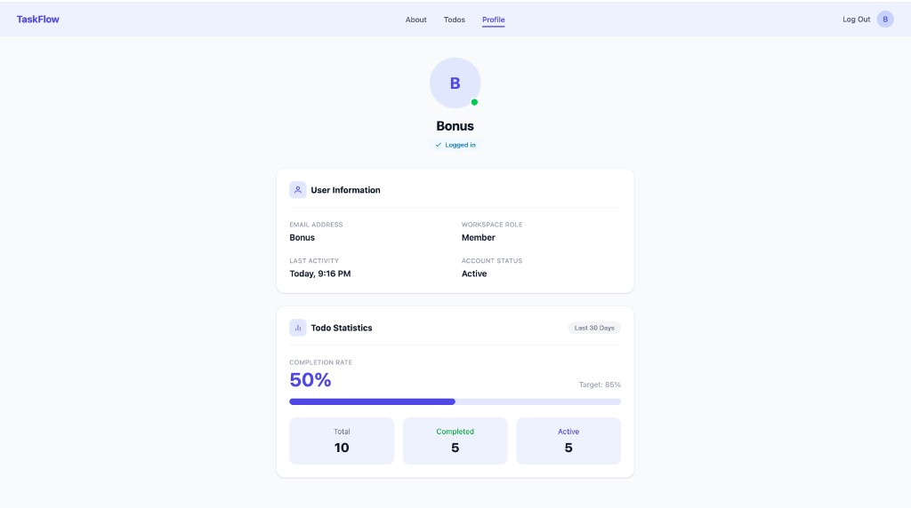

# TaskFlow

A modern, full-featured todo list application built for **Code The Dream Spring 2026**. TaskFlow helps users manage daily tasks with authentication, filtering, sorting, and a clean professional UI—designed for productivity without distraction.

## Live Demo
https://to-do-list-app-code-the-dream-sprin.vercel.app/login

## Short Video Demonstration of the App
https://www.youtube.com/watch?v=p9HoA5YFets

## Features

- **User authentication** — Secure login and logout with protected routes
- **Todo management** — Add, edit, complete, and uncomplete tasks
- **Workspace view** — Organized todo list with search and filters
- **Status filtering** — View all, active, or completed todos
- **Search** — Find todos by title with debounced input
- **Sorting** — Sort todos by creation date or title
- **Profile dashboard** — View user info and todo completion statistics
- **About page** — Project overview and tech stack highlights
- **Responsive design** — Styled layouts for desktop and mobile
- **Input validation & sanitization** — Client-side validation with DOMPurify for safe text handling
- **Optimistic updates** — Immediate UI feedback when toggling todo completion

## Technologies Used

| Category | Tools |
|----------|-------|
| **Framework** | React 19 |
| **Routing** | React Router 7 |
| **Build tool** | Vite 8 |
| **Styling** | Tailwind CSS 4, `@tailwindcss/vite` |
| **Security** | DOMPurify |
| **State management** | React Context, `useReducer` |
| **Language** | JavaScript (ES modules) |
| **Linting** | ESLint 9 |
| **API** | REST API with CSRF token authentication |

## Screenshots

### Desktop

**Todos / Workspace**



**About**



**Profile**



### Mobile


## Getting Started

### Prerequisites

- [Node.js](https://nodejs.org/) (v18 or higher recommended)
- npm (comes with Node.js)
- A running backend API (configured via environment variables)

### Installation

1. Clone the repository:

   ```bash
   git clone https://github.com/tanisnus/To-Do-List-App--Code-The-Dream-Spring-2026-.git
   cd To-Do-List-App--Code-The-Dream-Spring-2026-
   ```

2. Install dependencies:

   ```bash
   npm install
   ```

3. Create a `.env` file in the project root and set your API target:

   ```env
   VITE_TARGET=http://localhost:YOUR_API_PORT
   ```

4. Start the development server:

   ```bash
   npm run dev
   ```

5. Open the app in your browser (default: [http://localhost:3001](http://localhost:3001))

## Available Scripts

| Script | Command | Description |
|--------|---------|-------------|
| **dev** | `npm run dev` | Starts the Vite development server with hot module replacement |
| **build** | `npm run build` | Creates an optimized production build in the `dist/` folder |
| **preview** | `npm run preview` | Serves the production build locally for testing |
| **lint** | `npm run lint` | Runs ESLint across the project to check code quality |

## Design Decisions

TaskFlow uses a **purple-forward design system** built with Tailwind CSS utility classes:

- **Color palette** — Indigo/lavender backgrounds (`indigo-50`, `indigo-100`) with `#4F46E5` as the primary accent for buttons, active states, and branding
- **Layout** — CSS Grid for the header (logo, nav, user actions) and flexbox for todo cards, forms, and filter controls
- **Component structure** — Reusable shared components (`Header`, `Navigation`, `UserAvatar`, `ErrorMessage`) with page-level composition
- **Typography** — System sans-serif stack via Tailwind defaults for a clean, readable interface
- **Cards & spacing** — Rounded corners (`rounded-xl`, `rounded-2xl`), subtle shadows, and consistent padding for visual hierarchy
- **Accessibility** — Semantic HTML, `aria-label` on icon buttons, and visible focus states on form inputs

The UI was designed to feel like a professional workspace tool rather than a bare-bones todo list, while keeping interactions fast and minimal.

## Future Improvements

- Server-side input validation and rate limiting
- Persistent "remember me" / extended session support
- Drag-and-drop todo reordering
- Due dates, priorities, and categories/tags
- Dark mode theme toggle
- Real profile photos and editable user settings
- Offline support with local storage sync
- Unit and integration tests (Vitest, React Testing Library)
- Accessibility audit (WCAG compliance)

## License

This project is licensed under the MIT License.

```
MIT License

Copyright (c) 

Permission is hereby granted, free of charge, to any person obtaining a copy
of this software and associated documentation files (the "Software"), to deal
in the Software without restriction, including without limitation the rights
to use, copy, modify, merge, publish, distribute, sublicense, and/or sell
copies of the Software, and to permit persons to whom the Software is
furnished to do so, subject to the following conditions:

The above copyright notice and this permission notice shall be included in all
copies or substantial portions of the Software.

THE SOFTWARE IS PROVIDED "AS IS", WITHOUT WARRANTY OF ANY KIND, EXPRESS OR
IMPLIED, INCLUDING BUT NOT LIMITED TO THE WARRANTIES OF MERCHANTABILITY,
FITNESS FOR A PARTICULAR PURPOSE AND NONINFRINGEMENT. IN NO EVENT SHALL THE
AUTHORS OR COPYRIGHT HOLDERS BE LIABLE FOR ANY CLAIM, DAMAGES OR OTHER
LIABILITY, WHETHER IN AN ACTION OF CONTRACT, TORT OR OTHERWISE, ARISING FROM,
OUT OF OR IN CONNECTION WITH THE SOFTWARE OR THE USE OR OTHER DEALINGS IN THE
SOFTWARE.
```

## Contact

**GitHub:** 
https://github.com/tanisnus


---

Built with React and Tailwind CSS for Code The Dream Spring 2026.
